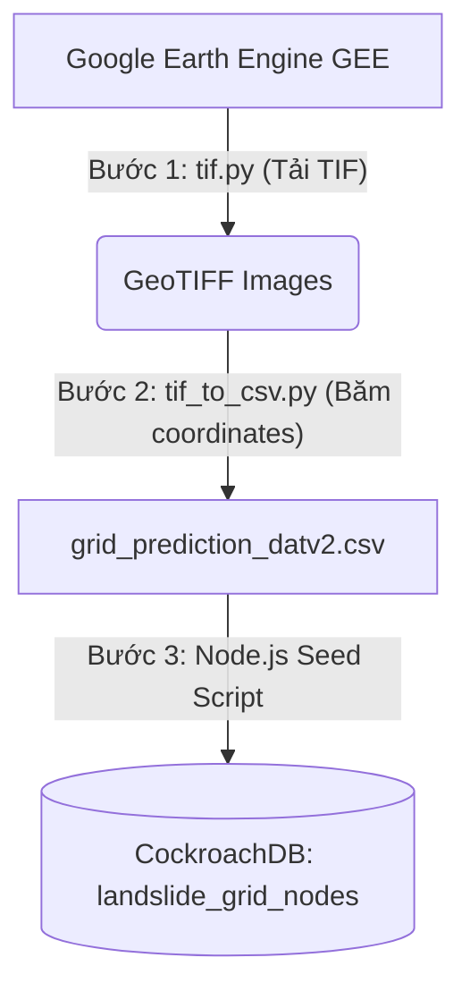

# 🛰️ Data Engineering & Offline ETL Data Pipeline (Module Sạt Lở Đất)

Chào mừng bạn đến với phân khu **Data Engineering** của dự án AQUAALERT. Đây là thư mục quy hoạch toàn bộ các luồng xử lý dữ liệu offline (Offline ETL Data Pipeline) phục vụ cho việc thu thập, chuyển đổi và chuẩn bị dữ liệu đầu vào cho mô hình dự báo sạt lở đất.

> [!IMPORTANT]
> **Đây là luồng chạy Offline hoàn toàn.**
> Tuyệt đối KHÔNG chạy tích hợp trực tiếp các script này vào Web Backend hay AI Service đang chạy online để tránh quá tải hệ thống.

---

## 🗺️ Tổng Quan Luồng Dữ Liệu (ETL Pipeline)

Quy trình ETL bao gồm 3 bước tuần tự như sau:



### 📍 Chi Tiết Các Bước Thực Hiện

#### **Bước 1: Tải ảnh vệ tinh GeoTIFF (`tif.py`)**
- **Nhiệm vụ**: Kết nối với **Google Earth Engine (GEE)** để tải xuống các ảnh vệ tinh định dạng GeoTIFF của khu vực Miền Bắc Việt Nam (gồm 14 tỉnh trọng điểm sạt lở: Yên Bái, Hà Giang, Lào Cai, Lai Châu, Điện Biên, Sơn La, Cao Bằng, Lạng Sơn, Tuyên Quang, Bắc Kạn, Thái Nguyên, Hòa Bình, Quảng Ninh, Phú Thọ).
- **Chi tiết kỹ thuật (v3)**:
  - Tải xuống **31 bands** chứa đầy đủ dữ liệu địa hình (DEM, Slope, Aspect, Hillshade, TPI, TRI, TWI...), dữ liệu thời tiết thực tế (mưa CHIRPS), độ ẩm đất (SMAP), hiện trạng thảm phủ (MODIS LULC, NDVI, EVI), và khoảng cách (sông, đường).
  - Áp dụng chiến lược **Fallback thông minh (Lùi tới ngày gần nhất có dữ liệu)**: Tự động tìm ảnh mới nhất của từng bộ dữ liệu tại server-side mà không lo lỗi trống dữ liệu (0 hoặc null giả tạo).
- **Đầu ra**: Các file ảnh vệ tinh `.tif` lưu về Google Drive hoặc thư mục cục bộ dạng `features_<TinhName>_<YYYY-MM-DD>.tif`.

#### **Bước 2: Băm ảnh vệ tinh thành tọa độ lưới (`tif_to_csv.py`)**
- **Nhiệm vụ**: Đọc các file ảnh vệ tinh GeoTIFF tải từ Bước 1, băm nhỏ từng pixel thành tọa độ các điểm lưới (Grid Nodes - kinh độ `lon` và vĩ độ `lat`) cùng các đặc trưng địa hình/thời tiết tại điểm đó.
- **Đầu ra**: File CSV thành phẩm `grid_prediction_datv2.csv` chứa hàng triệu bản ghi tương ứng với lưới dự báo sạt lở đất.

#### **Bước 3: Nạp dữ liệu vào Database (`backend/init-system`)**
- **Nhiệm vụ**: File CSV thành phẩm (`grid_prediction_datv2.csv`) sẽ được Web Backend Node.js sử dụng để nạp (seed) dữ liệu ban đầu vào bảng `landslide_grid_nodes` của CockroachDB thông qua các công cụ migration/seed hệ thống.

---

## 🛠️ Hướng Dẫn Cài Đặt & Chạy Offline

### 1. Chuẩn bị Môi Trường
Đảm bảo bạn đã cài đặt Python 3.8+ và các thư viện cần thiết.

```bash
pip install earthengine-api rasterio numpy pandas tqdm
```

### 2. Chạy Bước 1 - Kéo dữ liệu từ GEE
Xác thực tài khoản Google Earth Engine của bạn và chạy script:

```bash
# Xác thực tài khoản (chỉ cần chạy lần đầu)
earthengine authenticate

# Chạy pipeline kéo ảnh vệ tinh
python tif.py
```
*Lưu ý*: Các file `.tif` xuất ra sẽ được lưu trữ trực tiếp trên Google Drive của bạn (trong thư mục `DoAn_Landslide_PredMap` theo Project ID cấu hình).

### 3. Chạy Bước 2 - Chuyển đổi sang CSV
Tải các file `.tif` từ Google Drive về thư mục máy tính của bạn, cấu hình lại đường dẫn `GEOTIFF_DIR` trong file `tif_to_csv.py`, sau đó chạy:

```bash
python tif_to_csv.py
```
Kết quả thu được sẽ là file `grid_prediction_datv2.csv` nằm cùng thư mục `data_engineering`.

---

## ⚠️ Lưu Ý Quan Trọng
- **Bảo mật**: Tuyệt đối không commit các file `.env` chứa thông tin tài khoản GEE hoặc CockroachDB lên Git.
- **Dung lượng lớn**: Các file `.tif` ảnh vệ tinh có dung lượng cực kỳ lớn (lên tới hàng GBs). Dự án đã cấu hình quy tắc bỏ qua trong `.gitignore` (`data_engineering/*.tif`) để tránh đẩy các file khổng lồ này lên Github làm đơ repository.
